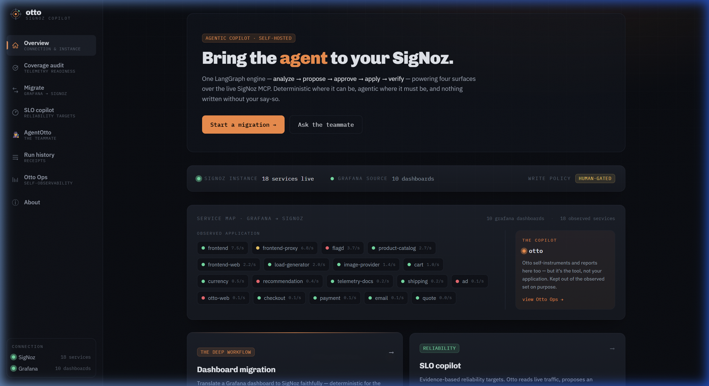
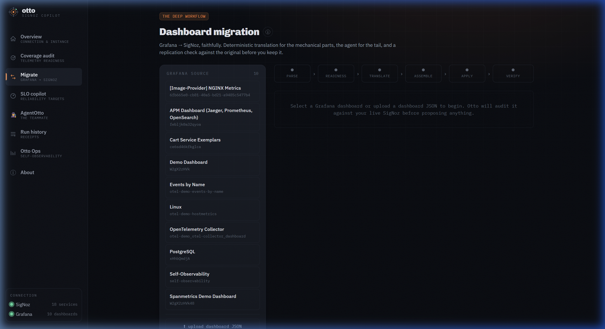
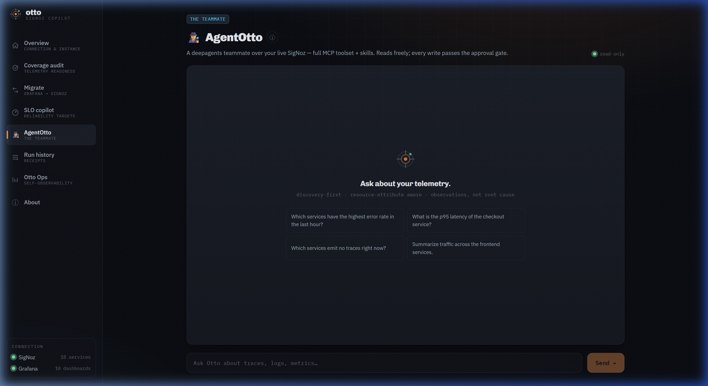
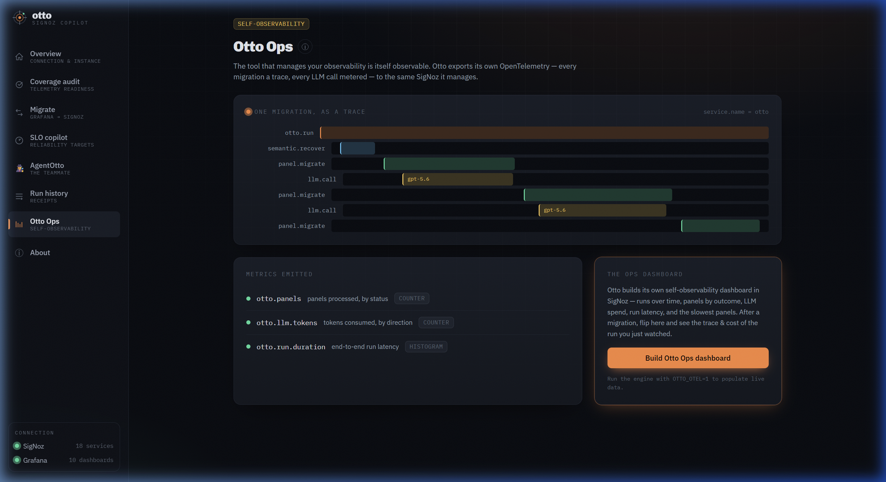

# Otto — a self-hosted agentic copilot for SigNoz

> Otto does the expert-judgment work that observability platforms leave to you — auditing your telemetry, migrating your Grafana dashboards, defining SLOs, and investigating day-to-day issues. Everything happens through one AI agent communicating over the live SigNoz MCP, with a strict human-approval gate on every write. To prove the architecture, Otto is itself fully observable in the same SigNoz instance.

📺 **[Watch the 3-minute Demo Video](https://www.youtube.com/watch?v=mm9d9IH9WBI)**  
📖 **[Read the Architecture Blog](https://medium.com/@Abid_/i-built-a-grafana-migration-and-slo-copilot-for-signoz-heres-what-i-learned-about-its-mcp-server-d4755fa0b10b)**

SigNoz gets teams 80% of the way to great observability and leaves the hardest 20% manual: its own
docs say Grafana dashboards must be *"recreated by hand,"* there's no readiness check before you
commit, defining a good SLO takes weeks of study, and self-hosted users have no AI teammate. Otto
is that missing 20%.



## Surfaces (each its own page)

| Page | What it does |
|---|---|
| **Overview** | Connection status + a live service map (Otto kept separate as the copilot). |
| **Coverage audit** | Live service × {traces, metrics, logs} matrix — finds services missing a signal in SigNoz. |
| **Migrate** | Grafana → SigNoz dashboard migration: deterministic translation + agent tail, **live-streamed steps**, a replication/fidelity check, and an approval gate. |
| **SLO copilot** | Reads live traffic, reasons like an SRE (binding SLI, latency trend, alternatives, error budget), proposes an objective, then builds the SLI dashboard + burn alert. |
| **AgentOtto 🕵️** | A conversational teammate with the full SigNoz MCP toolset + skills; multi-turn memory; every write behind an approval card. |
| **Run history** | Every applied migration/SLO as a scored receipt. |
| **Otto Ops** | Self-observability — Otto's own OpenTelemetry (traces + metrics + frontend RUM) in the same SigNoz. |

### In action

**Grafana → SigNoz migration, live-streamed**


**AgentOtto — every write behind an approval gate**


**The tool observing itself — `otto` + `otto-web` in the same SigNoz**


## How SigNoz is used (core to the project)

- **SigNoz MCP server (HTTP)** is Otto's only control path — reads (`list_services`, `list_metrics`,
  `get_field_keys/values`, `execute_builder_query`, `aggregate_traces`, `search_traces`,
  `get_dashboard`, …) and writes (`create_dashboard`, `create_alert`, `create_notification_channel`, …).
- **Dashboard build** through the full SigNoz Query Builder v5 — generated, validated against live
  data, and verified with a replication check.
- **Self-instrumentation** — Otto exports its own OTLP traces/metrics to SigNoz; it appears as the
  services **`otto`** (backend, `otto.run → panel.migrate → llm.call` traces) and **`otto-web`**
  (frontend RUM). See the **Otto Ops** page.

## Architecture

```
React + React-Router + TanStack Query (Vite)  ──/api──▶  Fastify + SSE
                                                            │
                          LangGraph engine (analyze→propose→approve→apply→verify)
                          ├─ deterministic PromQL→QueryBuilder mapper (unit-tested)
                          ├─ agent tail (ChatOpenAI) for the hard panels
                          └─ deepagents (AgentOtto) + SigNoz skills
                                                            │
                                        SigNoz MCP server (HTTP) ──▶ your SigNoz
                          OpenTelemetry (backend + agents + frontend RUM) ──▶ your SigNoz
```

Stack: TypeScript end-to-end · Fastify · LangGraph.js + `@langchain/openai` + deepagents ·
`@langchain/mcp-adapters` (HTTP) · React 18 + Vite + Tailwind v4 + React Router + TanStack Query +
Framer Motion · OpenTelemetry (Node + Web).

## Quick start

**Prerequisites:** a running self-hosted SigNoz + its MCP server (HTTP, `:8000/mcp`), and the
OpenTelemetry demo (or your own telemetry) flowing into SigNoz. Grafana is optional (migration source).

### Dev
```bash
# backend (API + engine) — port 8010
cd backend && cp .env.example .env   # fill SIGNOZ_API_KEY + OPENAI_API_KEY
OTTO_OTEL=1 npx tsx --env-file=.env src/server.ts

# frontend — port 5273
cd frontend && npm install && npm run dev
```

### Docker (one command)
```bash
cp .env.example .env                 # fill SIGNOZ_API_KEY + OPENAI_API_KEY
docker compose up --build
open http://localhost:5273
```
The app reaches your SigNoz over `host.docker.internal` by default; override the endpoints in `.env`.
If you don't already run the SigNoz MCP server, uncomment the `signoz-mcp` sidecar in `docker-compose.yml`.


## Acknowledgements
All telemetry data (traces, metrics, and logs) shown in the screenshots and used for testing this project was generated using the official [OpenTelemetry Demo](https://github.com/open-telemetry/opentelemetry-demo).
